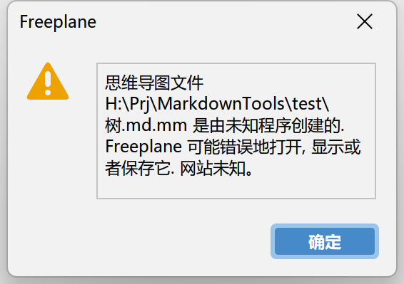

# MdOutline

Md 结构解析工具已经完成！

## Output

### Todo List

#### MdTodoList

生成 Markdown 格式的 Todo List

### Mindmap

#### Xmind

方案基本敲定，准备开发，不过目前可以使用 opml 文件直接导入，而且支持的比较完美！
鉴于目前可以通过 opml 的方法导入，因此，原生 xmind 的方案暂时搁置！

这里没有使用现有库 md2xmind 因为其识别的结果问题很大，
比如如果一级标题在更低级标题下面，那么识别会出现大错误，
因此我直接弃用了这个方案用自己解析器解析结果来生成！

#### Freemind/FreePlane

FreePlane 与 Freemind 界面基本相同，
而且 FreePlane 的界面更加好看，功能更多，
对高分屏的支持也更好！

但是当使用 FreePlane 打开 Freemind 的文件可能会有下面的错误

但是，经过我的尝试，您直接忽略就可以了！
因为 FreePlane 还是可以正常的识别 Freemind 格式的文件，
仅仅是因为 Freemind 的 mm 格式文件不包含 style 信息，
您重新另存为的过程中 FreePlane 会自动添加这些信息！

### OPML

目前生成的 OPML 文件仅支持 xmind 导入！

MindManager 界面我也挺喜欢的，但是用户比较少，而且格式比较复杂，至少很长一段时间不会去适配！

### HTML

代码部分不太完美，找一找有没有更好的轮子~

## 等待评估

- [ ] OmniOutliner
- [ ] iThoughts
- [ ] DEVONthink
- [ ] Anki

以及一些其他的 macOS 平台应用
